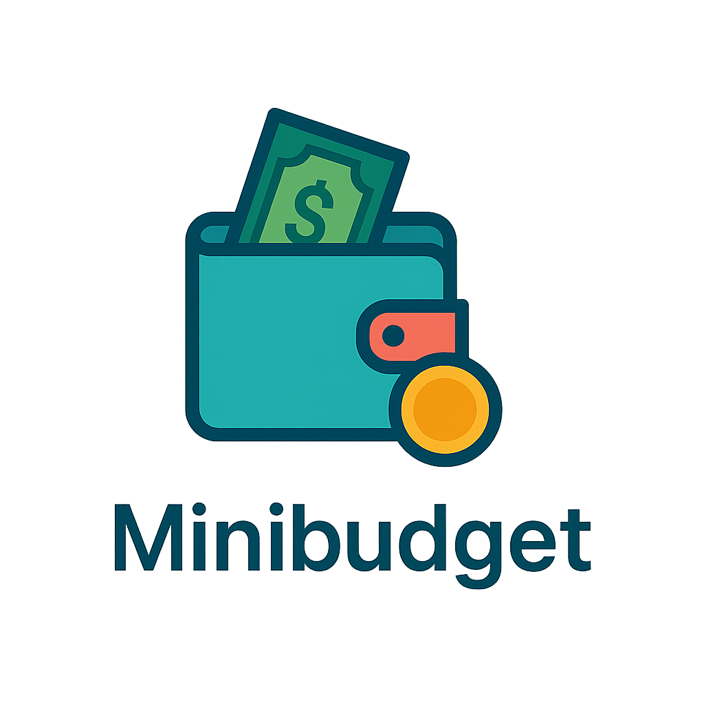
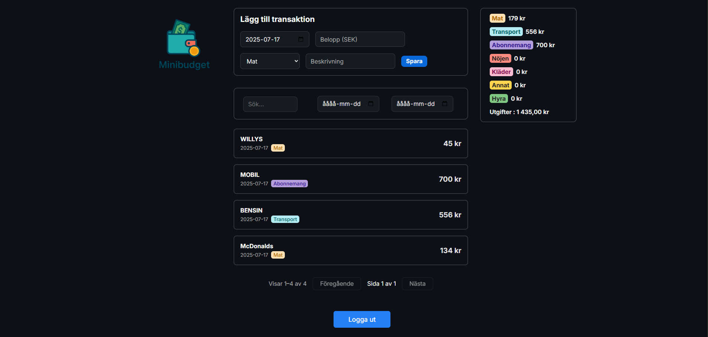

# MiniBudgetApp

En modern, responsiv budgetapp byggd med React, TypeScript och JWT-inloggning.

## Funktioner
- JWT-inloggning & utloggning (30 minuters session)
- Lägg till, filtrera och ta bort transaktioner
- Kategorisammanställning och summering
- Snygg, responsiv design
- Typad med TypeScript

## Kom igång

Gå till minibudget.netlify.app

Skapa ett konto eller logga in

Använd din e-postadress och ett lösenord för att skapa ett konto eller logga in.

Ditt lösenord sparas hashat för ökad säkerhet.

Lägg till och ta bort utgifter

När du är inloggad kan du lägga till, filtrera och ta bort transaktioner direkt i appen.

Observera:
Om appen inte har använts på ett tag kan det ta upp till 30 sekunder att starta, eftersom backend ligger på en gratis Render-tjänst som kan behöva vakna (s.k. cold start).

## Exempelbilder

## Licens
MIT

---

> Byggd av [Karl Ybring](https://github.com/KarlYbring)
